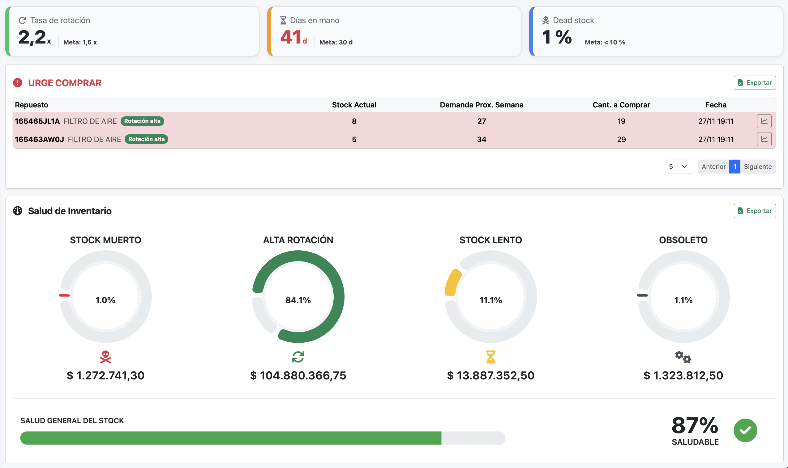
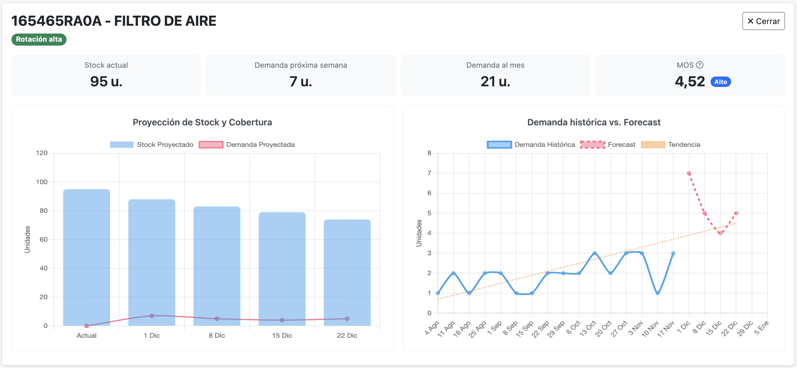
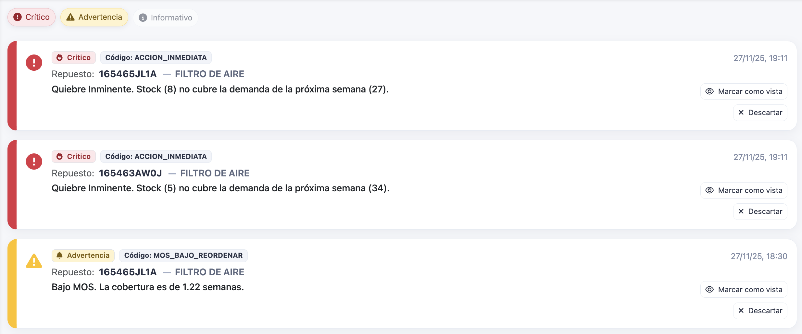
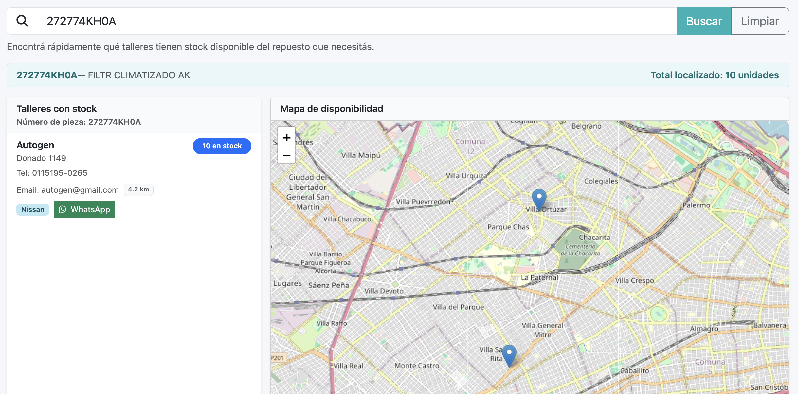
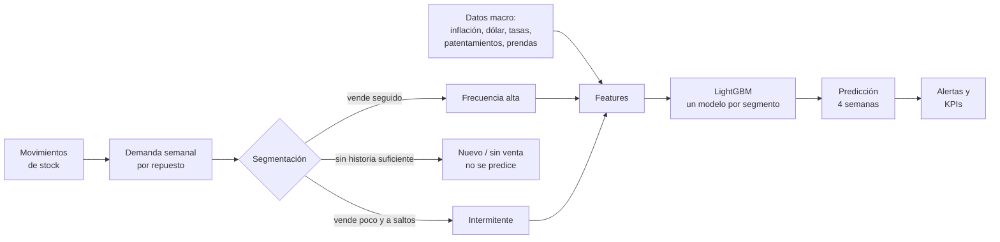

<p align="center">
  
</p>

<p align="center">
  <b>Gestión inteligente de stock de repuestos para talleres automotrices, con predicción de demanda por machine learning.</b>
</p>

<p align="center">
  
  
  
  
  
  
</p>

---

## ¿Qué es StockifAI?

En un taller o concesionario, tener demasiados repuestos inmoviliza plata y genera obsolescencia; tener pocos significa autos parados esperando una pieza. StockifAI ataca ese problema: centraliza el stock de uno o varios talleres, **predice cuántas unidades de cada repuesto se van a vender en las próximas 4 semanas** y genera alertas automáticas cuando hay riesgo de quiebre o exceso de stock.

Proyecto final de la carrera **Ingeniería en Sistemas de Información — UTN [Facultad Regional]**, [año].

## Funcionalidades

- **Dashboard** con KPIs de salud del inventario y reportes exportables a Excel.
- **Forecasting**: predicción semanal de demanda por repuesto para las próximas 4 semanas.
- **Alertas automáticas** con semáforo: quiebre inminente, stock bajo y sobrestock.
- **Clasificación de rotación** de cada repuesto: alta rotación, intermedio, lento, obsoleto o muerto.
- **Localizador**: mapa para encontrar qué taller del grupo tiene un repuesto en stock.
- **Catálogo** de repuestos con marcas y categorías.
- **Stock y movimientos** por depósito, con importación masiva desde Excel.
- **Talleres, grupos y usuarios** con roles, y autenticación con Auth0.

## Capturas

| Dashboard | Predicción de demanda |
|---|---|
|  |  |

| Alertas | Localizador |
|---|---|
|  |  |

## Cómo funciona el modelo de predicción

El forecasting corre automáticamente todos los domingos a las 23 h (con `django-crontab`) o a demanda desde la API, y repite el mismo proceso para cada taller:



1. **Preproceso.** Los movimientos se agrupan en ventas semanales por repuesto, completando con cero las semanas sin venta.
2. **Segmentación.** Cada repuesto se clasifica según qué tan seguido se vende. Los que venden en al menos el 25 % de las semanas son de *frecuencia alta*; el resto con ventas son *intermitentes*. Los que tienen menos de 26 semanas de historia o nunca vendieron quedan afuera del modelo.
3. **Features.** Para cada semana se calculan:
   - ventas de las semanas anteriores (lags, hasta 52 semanas atrás);
   - promedio, desvío y coeficiente de variación en ventanas de 4, 8, 12, 26 y 52 semanas;
   - calendario: mes, semana del año, trimestre, feriados argentinos y días hasta el próximo feriado;
   - variables macroeconómicas: inflación, tipo de cambio, tasa de interés, patentamientos, prendas e IPSA.
4. **Entrenamiento.** Se entrena un `LGBMRegressor` por segmento, optimizando el error absoluto (MAE). Los datos se dividen respetando el orden temporal (las últimas 4 semanas para validación y las 4 anteriores para test) y se valida con *rolling forecast*, simulando cómo se usaría en la realidad.
5. **Inferencia.** Se predicen las próximas 4 semanas de forma recursiva: la predicción de la semana 1 se usa como dato para calcular la semana 2, y así sucesivamente.
6. **Alertas.** Con la predicción y el stock actual se calculan los meses de cobertura y se disparan alertas: *crítica* si el stock no cubre la demanda de la próxima semana, *advertencia* si la cobertura es baja e *informativa* si hay sobrestock.

## Tecnologías

| Capa | Stack |
|---|---|
| Frontend | Angular 18, Bootstrap 5, Chart.js, Leaflet |
| Backend | Django 5, Django REST Framework, django-crontab |
| Machine learning | LightGBM, scikit-learn, pandas, NumPy |
| Base de datos | MySQL 8 |
| Autenticación | Auth0 (JWT) |
| Infraestructura | AWS, Nginx, Gunicorn |

## Estructura del repositorio

```
├── stockifai-backend/      # API en Django
│   ├── AI/                 # Pipeline de ML: preproceso, entrenamiento e inferencia
│   ├── inventario/         # Stock, movimientos, alertas, KPIs e importaciones
│   ├── catalogo/           # Repuestos, marcas y categorías
│   ├── user/               # Usuarios, talleres y grupos
│   ├── d_externo/          # Datos macroeconómicos externos
│   ├── auth0_backend/      # Integración con Auth0
│   └── datos_ejemplo/      # Excels de ejemplo para importar
├── stockifai-frontend/     # Aplicación en Angular
├── landing-page/           # Página de presentación del producto
└── base_datos/             # Script SQL de referencia
```


